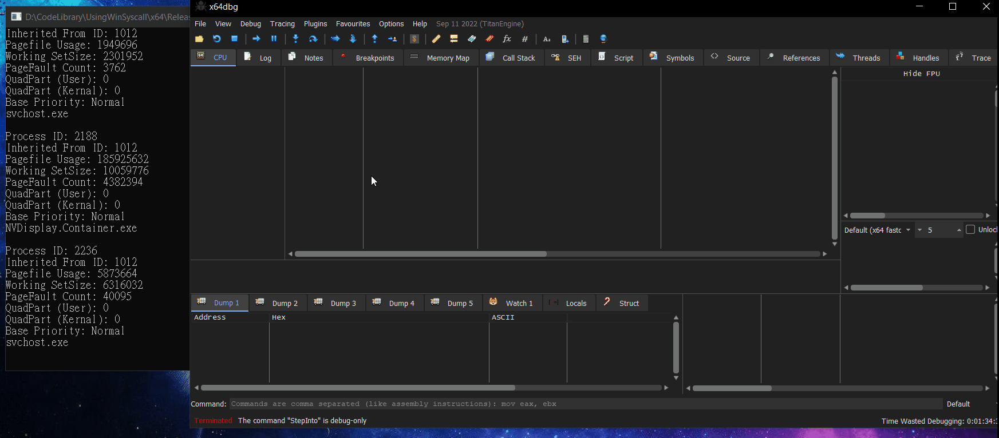

# UsingWinSyscall
UsingWinSyscall is a simple example of how to use Windows syscalls. Instead of using GetProcAddress, UsingWinSyscall defines the assembly code of x86/x64 syscall to call ntapi functions. Therefore, we cannot find out what syscall it calls by looking it up in the import address table or setting breakpoints at GetProcAddress and the address of the syscall in ntdll. Since Windows OS frequently updates SSDT table, UsingWinSyscall reads ntdll file to find SSDT index.

# References
* [TitanHide](https://github.com/mrexodia/TitanHide)
* [List Processes using NtQuerySystemInformation](http://www.rohitab.com/discuss/topic/40626-list-processes-using-ntquerysysteminformation/)

# Demo
The program uses NTQuerySystemInformation to list  running processes. However, we notice that there is no GetProcAddress in the import address table, and the breakpoint at the address of NTQuerySystemInformation doesn't get hit.

